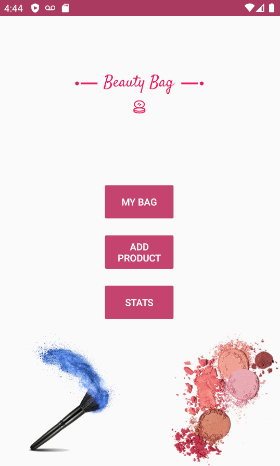
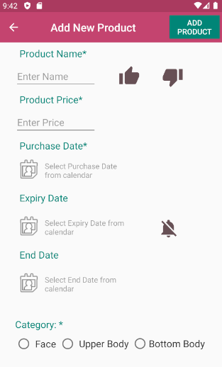
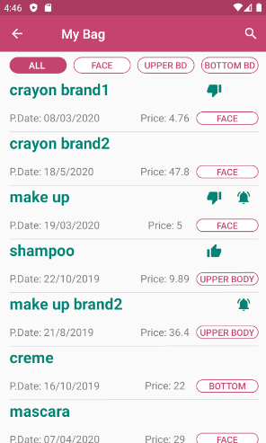
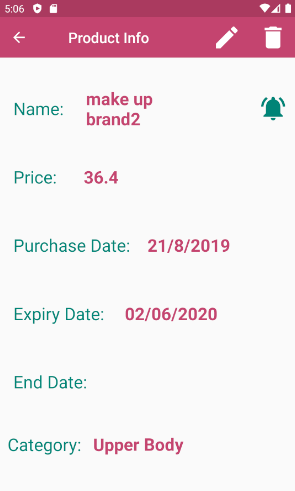
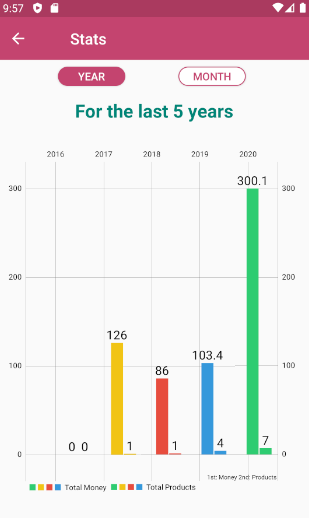
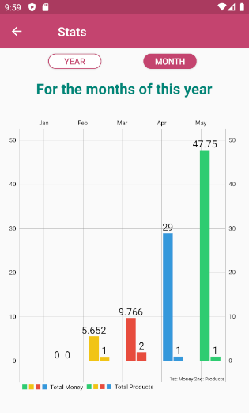

# Beauty Bag

Beauty Bag is an android app where you can organize your cosmetic products.

The core features of this Android App are:
- **Add product's info** (Name, Price, Purchase Date, Expiry Date (Reminder option), End Date, Category (3 options: Face, Upper Body, Bottom Body), Like or Disklike)
- **See all products or per category**
- **See/Search/Edit/Delete product**
- **Stats** about money spent and the number of products bought over the last 5 years or per months of the current year

## Screenshots

<table>
  <tr>
    <td></td>
    <td></td>
    <td></td>
  </tr>
    <tr>
    <td></td>
    <td></td>
    <td></td>
  </tr>
</table>
